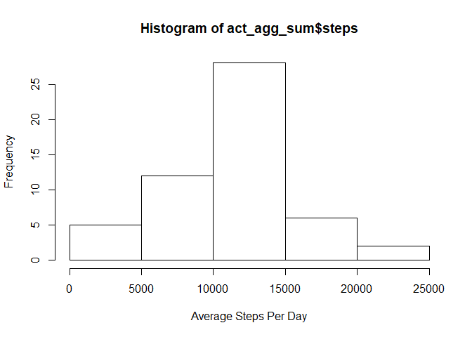
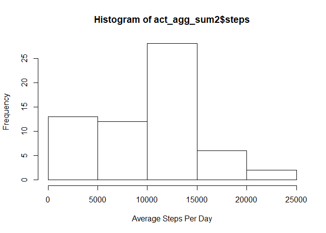
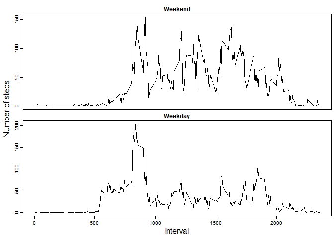

```r
knitr::opts_chunk$set(fig.path="figure/")
```

## Loading and preprocessing the data

The following code will download and unzip the csv then load it into "activity data set":


```r
download.file("https://d396qusza40orc.cloudfront.net/repdata%2Fdata%2Factivity.zip",
              destfile = "activity.zip")
unzip("activity.zip")
activity<- read.csv(file = "activity.csv")
summary(activity)
```

```
##      steps                date          interval     
##  Min.   :  0.00   2012-10-01:  288   Min.   :   0.0  
##  1st Qu.:  0.00   2012-10-02:  288   1st Qu.: 588.8  
##  Median :  0.00   2012-10-03:  288   Median :1177.5  
##  Mean   : 37.38   2012-10-04:  288   Mean   :1177.5  
##  3rd Qu.: 12.00   2012-10-05:  288   3rd Qu.:1766.2  
##  Max.   :806.00   2012-10-06:  288   Max.   :2355.0  
##  NA's   :2304     (Other)   :15840
```
as we can see we have 2304 rows with NA values in steps, so for the first part of the assignment we will remove those rows abd create a new dataset that we can work on it as following


```r
act_without_na <- activity[!is.na(activity$steps),]
```

## What is mean total number of steps taken per day?

we will use the aggregate function to get the total steps per day as following:


```r
act_agg_sum <- aggregate(steps ~ date, data = act_without_na, 
                                              FUN = sum )
```

drawing the histogram of the total number of steps taken each day:

```r
hist(act_agg_sum$steps, xlab ="Average Steps Per Day")
```

<!-- -->

the mean and median of the total number of steps taken per day:

```r
mean(act_agg_sum$steps)
```

```
## [1] 10766.19
```

```r
median(act_agg_sum$steps)
```

```
## [1] 10765
```

## What is the average daily activity pattern?

we will use the aggregate function again to calculate the average number of steps taken in interval averged through all days:


```r
act_agg_avg <- aggregate(steps ~ interval, data = act_without_na, 
          FUN = mean )
```

plotting the time series:

```r
plot(x = act_agg_avg$interval, y = act_agg_avg$steps, type = "l",
     xlab =  "5-minute interval", ylab = "Average number of steps")
```

<!-- -->

the 5-minute interval, on average across all the days in the dataset,that contains the maximum number of steps is:

```r
act_agg_avg[act_agg_avg$steps == max(act_agg_avg$steps), "interval"]
```

```
## [1] 835
```


## Imputing missing values


i will take the median of steps per day and replacing the values has NA.
so first we calculate the median per day using aggregate function on the dataset act_without_na:

```r
act_agg_median <- aggregate(steps ~ date, data = act_without_na, 
                          FUN = median )
act_agg_median
```

```
##          date steps
## 1  2012-10-02     0
## 2  2012-10-03     0
## 3  2012-10-04     0
## 4  2012-10-05     0
## 5  2012-10-06     0
## 6  2012-10-07     0
## 7  2012-10-09     0
## 8  2012-10-10     0
## 9  2012-10-11     0
## 10 2012-10-12     0
## 11 2012-10-13     0
## 12 2012-10-14     0
## 13 2012-10-15     0
## 14 2012-10-16     0
## 15 2012-10-17     0
## 16 2012-10-18     0
## 17 2012-10-19     0
## 18 2012-10-20     0
## 19 2012-10-21     0
## 20 2012-10-22     0
## 21 2012-10-23     0
## 22 2012-10-24     0
## 23 2012-10-25     0
## 24 2012-10-26     0
## 25 2012-10-27     0
## 26 2012-10-28     0
## 27 2012-10-29     0
## 28 2012-10-30     0
## 29 2012-10-31     0
## 30 2012-11-02     0
## 31 2012-11-03     0
## 32 2012-11-05     0
## 33 2012-11-06     0
## 34 2012-11-07     0
## 35 2012-11-08     0
## 36 2012-11-11     0
## 37 2012-11-12     0
## 38 2012-11-13     0
## 39 2012-11-15     0
## 40 2012-11-16     0
## 41 2012-11-17     0
## 42 2012-11-18     0
## 43 2012-11-19     0
## 44 2012-11-20     0
## 45 2012-11-21     0
## 46 2012-11-22     0
## 47 2012-11-23     0
## 48 2012-11-24     0
## 49 2012-11-25     0
## 50 2012-11-26     0
## 51 2012-11-27     0
## 52 2012-11-28     0
## 53 2012-11-29     0
```

**as we can see all the medians are zero so we will replace the NAs Steps with zeros:**

```r
act_replace_na <- activity
act_replace_na[is.na(act_replace_na$steps), "steps"] <- 0
```

now we will make a histogram of the total number of steps taken each day using the act_replace_na dataset and aggregate function:

```r
act_agg_sum2 <- aggregate(steps ~ date, data = act_replace_na, 
                         FUN = sum )
hist(act_agg_sum2$steps, xlab ="Average Steps Per Day")
```

<!-- -->

the mean and median of the total number of steps taken per day for the new dataset:

```r
mean(act_agg_sum2$steps)
```

```
## [1] 9354.23
```

```r
median(act_agg_sum2$steps)
```

```
## [1] 10395
```

as we can see there is a differnce in mean and median but not in histograms as we impute the NAs with zeros.


## Are there differences in activity patterns between weekdays and weekends?


The following code adds a variable with name "weekday" contains the name of weekday of the date and adds a new factor variable "dayType" in the dataset with two levels weekday and weekend indicating whether a given date is a weekday or weekend day:

```r
act_replace_na$weekday <- weekdays(as.Date(act_replace_na$date))
act_replace_na$dayType <- "weekday"
act_replace_na[act_replace_na$weekday %in% c("Saturday", "Sunday"),"dayType"]<-
  "weekend"
act_replace_na$dayType <- as.factor(act_replace_na$dayType)
```

the following code creates a panel plot containing a time series plot (i.e. type = "l") of the 5-minute interval (x-axis) and the average number of steps taken, averaged across all weekday days or weekend days (y-axis):

```r
act_avg_weekday <- aggregate(steps ~ interval, data =
                          act_replace_na[act_replace_na$dayType == "weekday",], 
                          FUN = mean )
act_avg_weekend <- aggregate(steps ~ interval, data =   
                          act_replace_na[act_replace_na$dayType == "weekend",], 
                          FUN = mean )
par(mfrow=c(2,1), mar = c(0, 0, 2, 0), 
    mgp = c(2,0.6,0), 
    oma = c(4, 4, 0.5, 0.5 ), cex = 0.6)

plot(x = act_avg_weekend$interval, xaxt = "n", y = act_avg_weekend$steps, type = "l",
     xlab =  "", ylab = "", main =    
     "Weekend")
plot(x = act_avg_weekday$interval, y = act_avg_weekday$steps, type = "l",
     xlab =  "", ylab = "", main =    
     "Weekday")
mtext("Interval", side = 1, outer = TRUE, cex = 1, line = 2.2)
mtext("Number of steps", side = 2, outer = TRUE, cex = 1, line = 2.2)
```

<!-- -->

**as we can see there is a difference.**
